# Prat-Analise-de-Sistemas

# Especificação de requisitos
## PROJETO: Aplicativo para Recomendação de Filmes, Séries e Livros
### Curso de Sistemas de Informação
### Prática Profissional em ADS
### Turmas 05K 
### 1º semestre de 2021

                                                   UNIVERSIDADE PRESBITERIANA MACKENZIE
                                                   
                                                   FACULDADE DE COMPUTAÇÃO E INFORMÁTICA

                                                     FELIPE MARTINEZ SILVA - TIA: 31923224
                                                     FERNANDO SAETA REBELATO - TIA: 31944078
                                                     GABRIEL NOVAES LEE - TIA: 31920462
                                                     GUSTAVO GONTARZIK - TIA: 31949142

                                             Aplicativo para Recomendação de Filmes, Séries e Livros 
                                                                 Critic Hub

                                                                  SÃO PAULO 
                                                                    2021

# Introdução

Este é um documento de especificação de requisitos para um novo aplicativo para recomendações de filmes, séries e livros. A promoção do engajamento de colaboradores é fundamental para o desenvolvimento de bons trabalhos no mundo corporativo. Nesta linha, empresas buscam formas de criar situações de compartilhamento de experiências para que as pessoas envolvidas se conheçam e promovam sinergia entre as pessoas, de modo a promover maior desempenho em grupos multidisciplinares, também conhecidos por Squads. Considerando que os serviços de streaming nunca estiveram tão em alta graças à pandemia do coronavírus, bem como, escolher entre milhares de filmes, séries ou livros disponíveis pode ser uma tarefa um tanto quanto estressante. Sendo assim, nossa empresa, optou por criar um aplicativo de recomendação para Filmes, Séries e Livros, capaz de permitir acesso e participação dos nossos colaboradores, de modo a prover interação com contribuições na forma de dicas e recomendações sobre filmes, séries e livros. 

Este documento descreve os requisitos não funcionais, modelagem dos requisitos funcionais com casos de uso e modelar os conceitos do domínio do problema.

# Informações sobre a empresa

A rede social Critic Hub, chegou no mercado como mais uma forma interativa de recomendações de filmes, séries e livros. Essa rede social é a primeira desenvolvida pela empresa Y e o nosso objetivo é facilitar as conexões sociais entre as pessoas que compartilham do mesmo interesse e/ou valores, levando a uma interação favorável para todos. A base de dados da plataforma é imensa, onde reúne várias informações sobre as características de filmes, séries e livros, desde os clássicos até os recentes. A nossa plataforma é atualizada diariamente com filmes, séries e livros, para que os nossos membros aproveitem essas conexões.
Devido à natureza técnica e inovadora do nosso produto, a empresa possui uma equipe de suporte para eventuais falhas, administradores que serão capazes de orientar e validar os cadastramentos. Esses administradores são especialistas no assunto, e estão focados na geração de documentos técnicos e nas especificações da rede social.

# Escopo do projeto

O escopo do projeto é um aplicativo de uma rede social, que dará recomendações, cadastramento e avaliações sobre filmes, séries e livros, através de membros, que podem ser qualquer usuários. Além disso, poderá montar sua própria lista indicações e terá a sua própria lista sobre filmes, livros e séries que desejam ver futuramente. A publicidade e a cobrança não são parte deste projeto
A engine de pesquisa sobre filmes, séries e livros será adquirida como um componente pronto para o novo sistema. Os detalhes internos não serão tratados no projeto. Questões de segurança do site, além da proteção por senha no próprio site, somente pessoas autorizadas podem ter acessos às informações e recursos, onde o acesso do membro será feito somente a recursos que ele tem permissão. O acesso aos recursos mais importantes será feito por pessoas autorizadas e se for feito por outros usuários, o acesso será monitorado constantemente. Preservado a segurança da nossa rede social, existirá a verificação da integridade e vulnerabilidade, autenticação de usuários, ferramentas de segurança de rede, focando no acesso e trafego da rede. Focamos em criar programas seguros, fazendo com que o sistema seja mais difícil de ser invadido com as técnicas mais comuns de invasões.

# Interessados

Aqueles que irão se beneficiar diretamente e aqueles que serão afetados pelo novo sistema:

Membros: Conseguirão navegar pelo site para cadastrar, recomendar, avaliar, os filmes, livros e séries. Terão uma vasta quantidade de opções de mecanismo na rede social.

Administradores: Conseguirão navegar pelo site e serão responsáveis pela validação e verificação dos cadastramentos.

Suporte: Em eventuais dúvidas e/ou falhas, eles serão responsáveis por facilitar essas informações.

Departamento de Marketing: Os dados de navegação no site poderiam ser enviados para o departamento de marketing. Entendendo como um membro usa o site ao fazer uma recomendação ou cadastramento, por exemplo,  fazendo com que possa propor melhores implementações para manter o nosso usuário ativo. 

Departamento de Tecnologia da Informação: Será responsável pela implementação da nova base de dados, hospedagem da aplicação e manutenção do sistema

Serviço de Atendimento ao Consumidor(SAC): O sistema reduzirá a carga de trabalho no SAC, pois os clientes conseguirão encontrar de forma mais fácil as informações que necessitam

# Objetivos funcionais

RF1	O sistema deve permitir o cadastro do usuário e deverá conter: nome completo, username, senha , data de nascimento, cidade e estado.
- O perfil do usuário sempre vai estar com as descrições importantes.

RF2	O sistema deve permitir que o usuário possa fazer o login
- Isto melhorará o controle sobre o seu perfil na rede social.

RF3	O sistema permitirá que os membros façam alterações em seus cadastros.
- Isto fará com que os dados sejam alterados em eventuais mudanças.

RF4	O sistema deve permitir que o usuário possa excluir o seu cadastro pessoal.
- Isto fará com que o membro saia  permanentemente da rede social .

RF5	O sistema deve permitir incluir descrição no seu perfil de membro
- Isto fará para melhorar o seu perfil.

RF6	O sistema deve permitir incluir fotos do membro em seu perfil
- Isto fará para melhorar o seu perfil .

RF7	O sistema deve apresentar uma descrição detalhada dos filmes, séries e livros.
- Isto fará com que melhore a qualidade do conteúdo da rede social.

RF8	O cadastro de um livro deverá conter: título, autor(es), editora, país, ano de lançamento.
- Isto melhorará as informações sobre os detalhes dos livros.

RF9	O cadastro de um filme deverá conter: título, diretor, elenco principal, país, ano.
- Isto melhorará as informações sobre os detalhes dos filmes.

RF10	O cadastro de uma série deverá conter: título, diretor, elenco principal, país, ano, número de temporadas.
- Isto melhorará as informações sobre os detalhes das séries.

RF11	O sistema deve permitir a realização de adicionar comentários às avaliações feitas pelo outro, desde que tenham relacionamento de amizade.
-Isto fará com que aumente o número de opiniões diferentes sobre o determinado filme,série ou livro.

RF12	O sistema deve permitir que o membro possa “reagir” a avaliação do membro através de um emoticon “joinha”.
 - Isto fará o aumento de opiniões e avaliações 
 
RF13	O sistema deve permitir que o membro que reagiu a avaliação de outro membro, possa retirar o “joinha” dado.
- Isto fará com que opiniões podem ser mudadas

RF14	O sistema deve permitir que um usuário possa pedir relacionamento de amizade a outro membro.
- Está informação fará com que o ciclo de amizade aumente. 

RF15	O sistema deve mostrar os amigos em comum, quando um usuário visita a página de outro.
- Esta informação fará com que o ciclo de amizade aumente através de amigos em comum entre os membros.

RF16	O sistema deve sugerir amizades de membros para o outro membro.
- Isto melhorará o serviço de interatividade entre os membros da rede social, trazendo um maior número de recomendações.

RF17	O sistema deve permitir que o administrador possa validar o cadastramento de filmes, livros e séries. 
- Isto melhorará a qualidade do conteúdo da rede social.

RF18	O sistema deverá permitir que sejam realizados pesquisas em todo o texto das páginas web a que o membro tenha acesso.
- Isto melhorará as formas de pesquisa do conteúdo.

# Objetivos não-funcionais

RNF1	O sistema deverá utilizar um algoritmo colaborativo para oferecer as recomendações a um determinado membro.

RNF2	Após o sistema ter pelo menos 10 membros cadastrados e cada membro 10 avaliações, o sistema passará a apresentar para cada membro recomendações de filmes, séries e livros.

RNF3	O sistema deverá receber a sugestão de 3 membros que poderiam ser seus amigos

RNF4	O sistema deverá permitir o número médio de amigos dos membros da rede social.

RNF5	O sistema deverá permitir uma lista com os 10 membros mais conectados

RNF6	O sistema deverá um gráfico mostrando a relação entre o número de amigos e o estado onde mora.

RNF7	É desejável que o tempo de carga para uma página não seja superior a 5 segundos.

RNF8	A disponibilidade da aplicação deverá atender o padrão 99.99%, em regime 24x7.

RNF9	A documentação do sistema deverá apresentar indicativos de como os dados cadastrais e transacionais estão assegurados contra eventuais invasões ao site do sistema.

RNF10	Os dados devem ser persistidos em uma base de dados

RNF11	Os membros deverão acessar as funções da rede social através da web ou por aplicativos móveis

RNF12	A aplicação deve ser responsiva e leve, evitando demoras no carregamento das funcionalidades.

RNF13	A aplicação deve ser implantada em um provedor de serviços na Internet .

RNF14	Desenvolvedores terão que dar suporte para os usuários e eventuais problemas no sistema.

RNF15	O sistema deverá ser acessado completamente via browser HTTP/HTML.

RNF16	O produto será disponibilizado em português, mas de forma a permitir que versões em línguas diferentes possam ser produzidas sem necessidade de ter acesso ao código fonte.
RNF17	Suporte ao produto será feito exclusivamente através de site Web, com acesso a Base de Conhecimento sobre o aplicativo.

RNF18	Deve emitir relatórios por membros cadastrados.

RNF19	Deve emitir relatórios por filmes, séries e livros cadastrados.

RNF20	Deve ser executável em qualquer plataforma

RNF21	Ser desenvolvido na linguagem Python.

RNF22	Ser utilizado o framework Django para desenvolvimento do aplicativo.

RNF23	O sistema deve garantir que somente usuários com permissão tenham acesso às informações.

RNF24	Integridade das informações: o sistema deve garantir a integridade das informações gravadas em banco de dados.

RNF25	O sistema deve ter interfaces simplificadas, legível e sem poluição visual.

RNF26	As informações do sistema devem ser de fácil consulta e possuir cadastros rápidos

RNF27	O sistema deve manter o tempo de timeout ativo enquanto o usuário estiver utilizando.

RNF28	O sistema deve estar sempre disponível.

RNF29	O sistema deve ser executado em computadores Intel Core i3 ou superior, aceitando qualquer tipo de sistema operacional.

# COTS (Commercial Off-The-Shelf)

Os softwares que serão adquiridos para compor o sistema são:

* Tradutor do português para o inglês e do português para o espanhol.

* Engine de pesquisa.

# Casos de uso
## Diagrama de casos de uso

## Especificações dos casos de uso

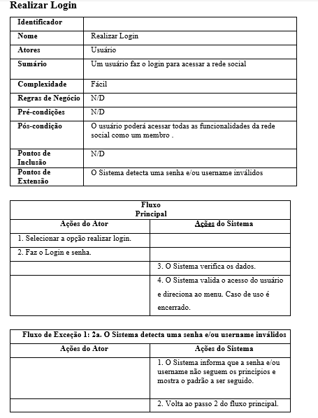

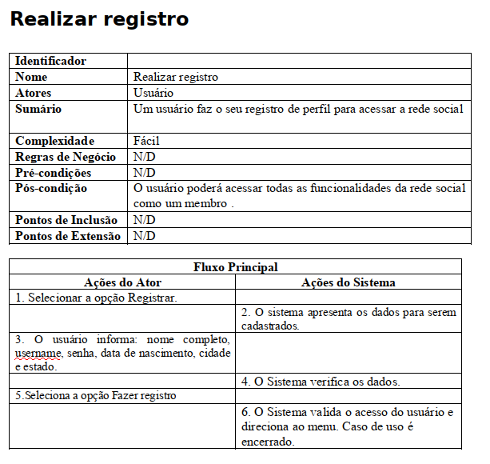

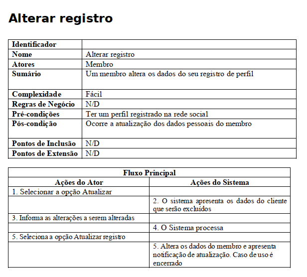

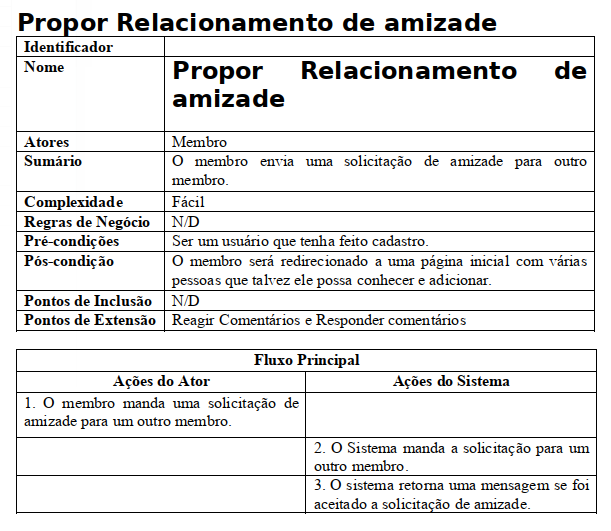

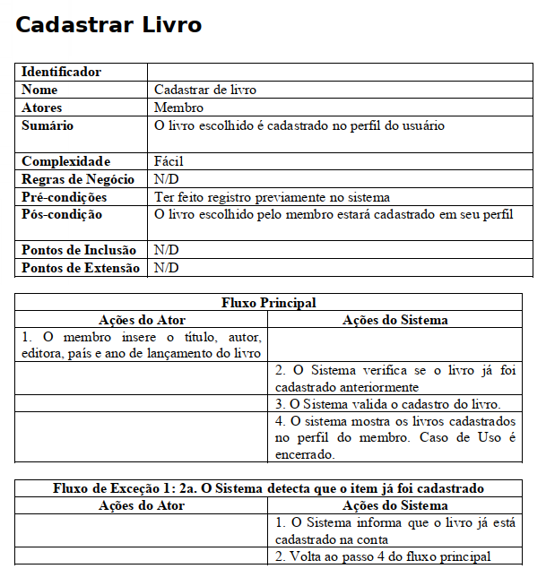

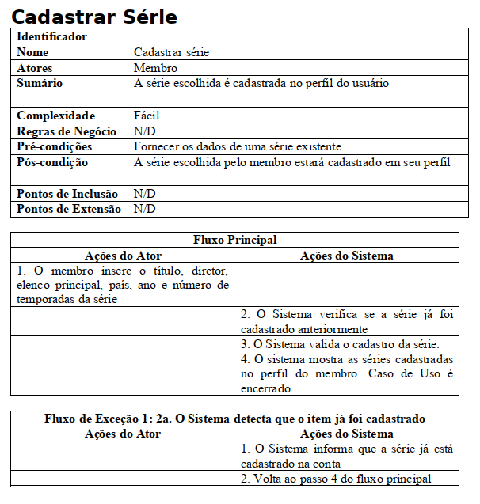

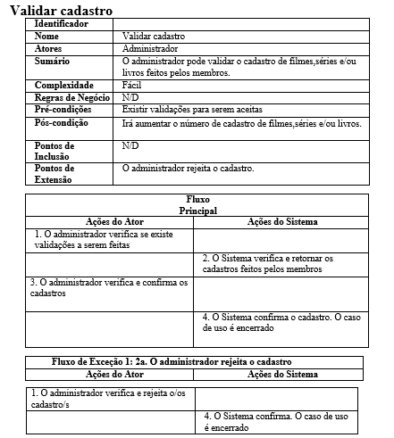

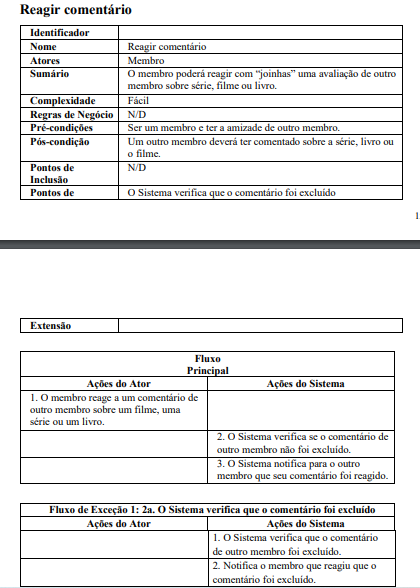

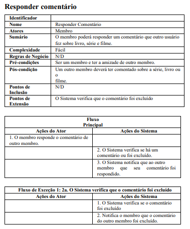

# Wireframes
###1. Tela de Login

&nbsp;
&nbsp;
###2. Tela de Registro de Usuário
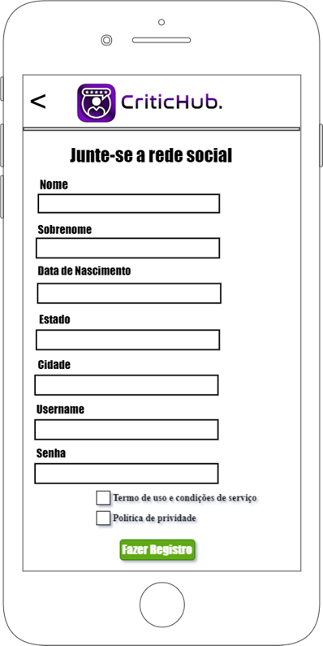
&nbsp;
&nbsp;
###3. Alterar Registro
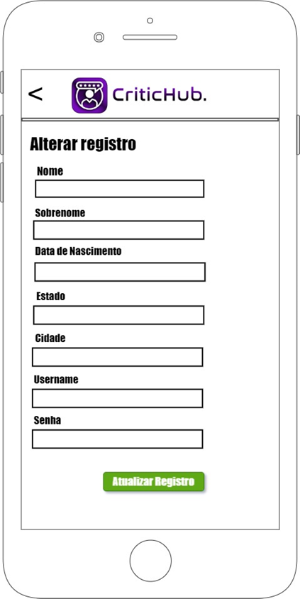
&nbsp;
&nbsp;
###4. Excluir Registro

&nbsp;
&nbsp;
###5. Menu de opções no perfil do usuário
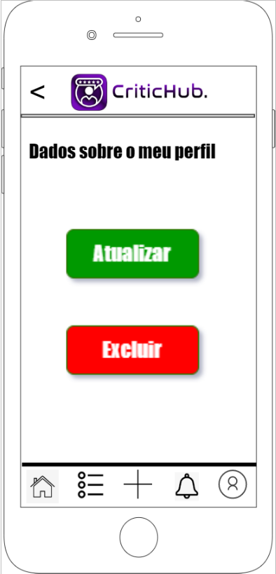
&nbsp;
&nbsp;
###6. Tela Principal de Cadastro
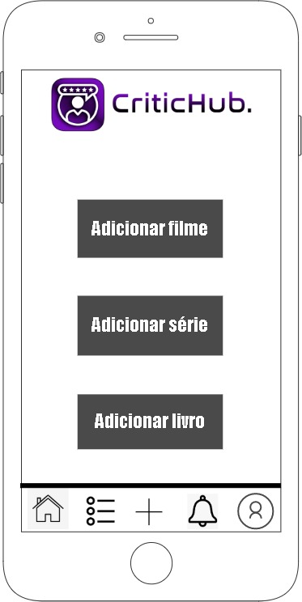
&nbsp;
&nbsp;
###7. Tela de Cadastro de Filme
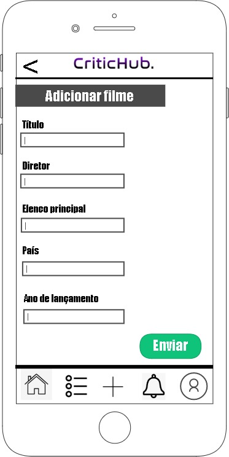
&nbsp;
&nbsp;
###8. Tela de Cadastro de Serie
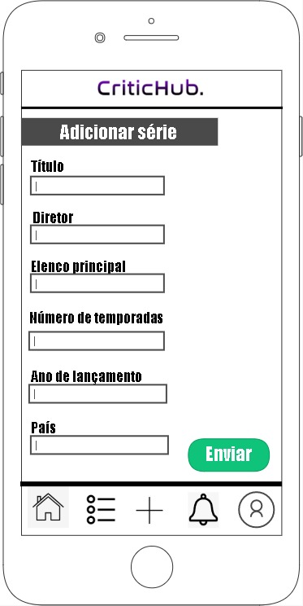
&nbsp;
&nbsp;
###9. Tela de Cadastro de Livro
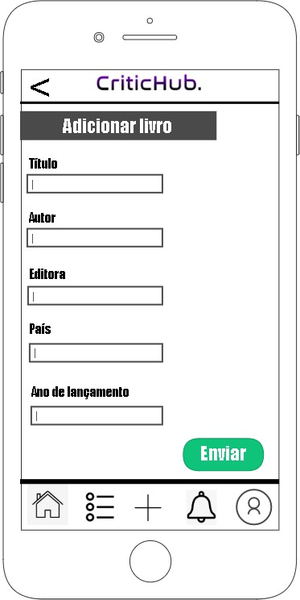
&nbsp;
&nbsp;
###10. Tela de Cadastro Efetuado

&nbsp;
&nbsp;
###11. Tela de Nova Avaliação

&nbsp;
&nbsp;
###12. Tela de Reagir e Comentar Avaliações e Comentários
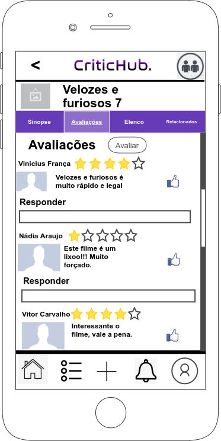
&nbsp;
&nbsp;
###13. Tela de Itens cadastrados a serem validados

&nbsp;
&nbsp;
###14. Tela de validar Cadastro de Item
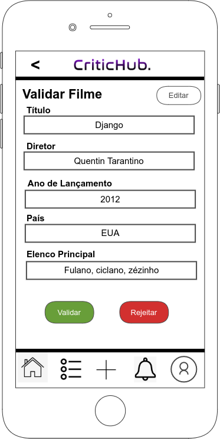
&nbsp;
&nbsp;
###15. Tela de Procurar Amigos
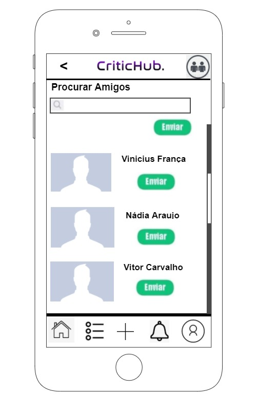
&nbsp;
&nbsp;

# Diagramas de Sequencias
&nbsp;

## Realizar Login

&nbsp;
## Realizar Registro

&nbsp;
## Alterar Registro

&nbsp;
## Excluir Registro

&nbsp;
## Propor Relacionamento de Amizade

&nbsp;
## Cadastrar Item

&nbsp;
## Cadastrar Livro

&nbsp;
## Cadastrar Filme

&nbsp;
## Cadastrar Serie

&nbsp;
## Validar Cadastro

&nbsp;
## Fazer Avaliação

&nbsp;
## Reagir Avaliação

&nbsp;
## Reagir Comentario

&nbsp;
## Responder Comentario

&nbsp;

# Diagrama de Classes

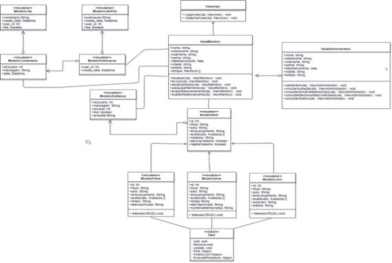
&nbsp;

# Diagrama de Domínio
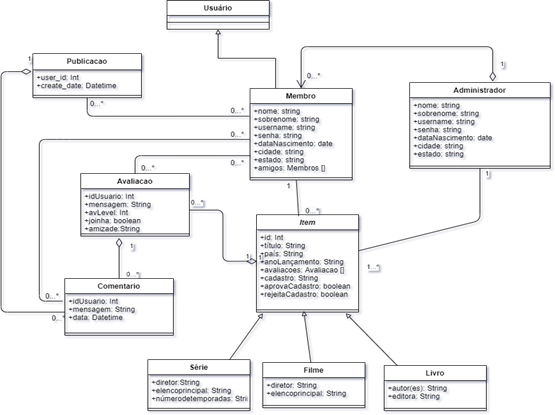
